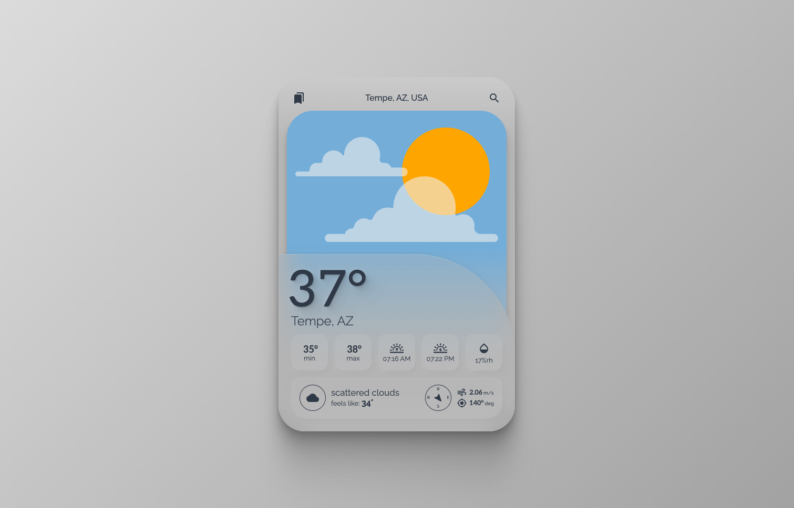
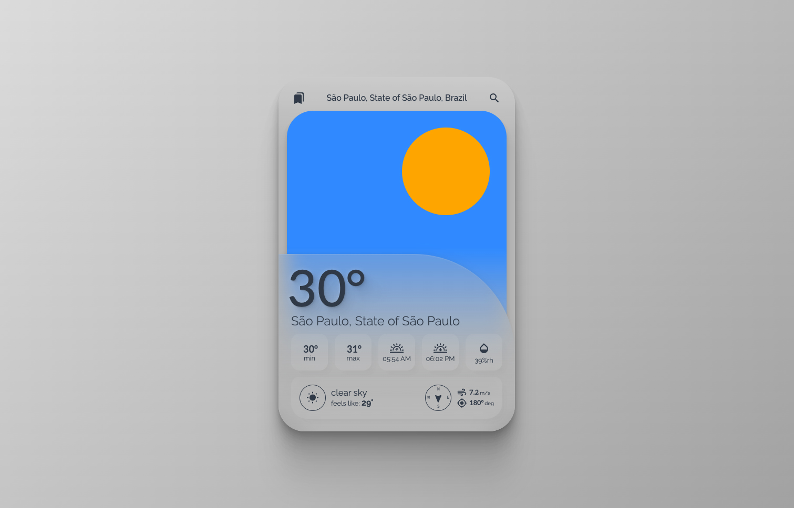
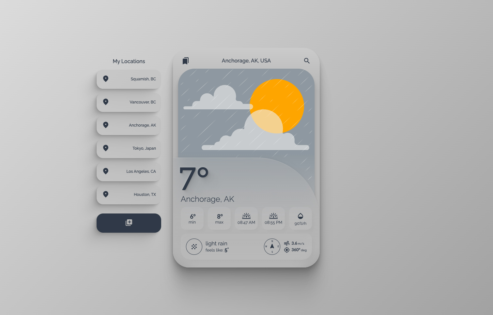

# Weather App - Practice / Prototype

A fun weather app (prototype) where users can search for available weather information for any city.

_A work-in-progress build!_

Built leveraging the [OpenWeatherMap API](https://openweathermap.org/api) to gather weather information and Google's [Places API](https://developers.google.com/maps/documentation/places/web-service/overview) and [Maps JavaScript API](https://developers.google.com/maps/documentation/javascript/overview) for accurate location search.



## A simple UI that displays:

- Current temperature
- Location
- Min/Max temperatures
- Sunrise/Sunset times (local) \*_see note near end of readme_
- Relative humidity
- Current conditions
- Feels-like temperature
- Wind speed and wind direction
- Dynamic sky styling and sun/moon phases

## Get Started

### 1. Clone this repository

```bash
git clone git@github.com:RyanMilbourne/weather-app.git
```

### 2. Navigate to project folder

```bash
cd weather-app
```

### 3. Install dependencies

```bash
npm install
```

### 4. Set up your API keys

You'll need to set up API keys for OpenWeatherMap and Google Cloud Platform (make sure Places and Javascript are enabled):

- Create a `.env` file in the root of the project
- Add your API keys in the correct VITE format:

```bash
VITE_WEATHER_API_KEY=your_api_key
VITE_GOOGLE_API_KEY=your_api_key
```

### 5. Start the development server

```bash
npm run dev
```

## Current "bug"

The function for converting OpenWeather's local time does not account for regions with daylight savings. Future update will solve this.

## Coming Features

Right now, there is a "bookmarks" tab for stored locations. This is a prototype and their is no function for adding/deleting/editing a bookmark.



